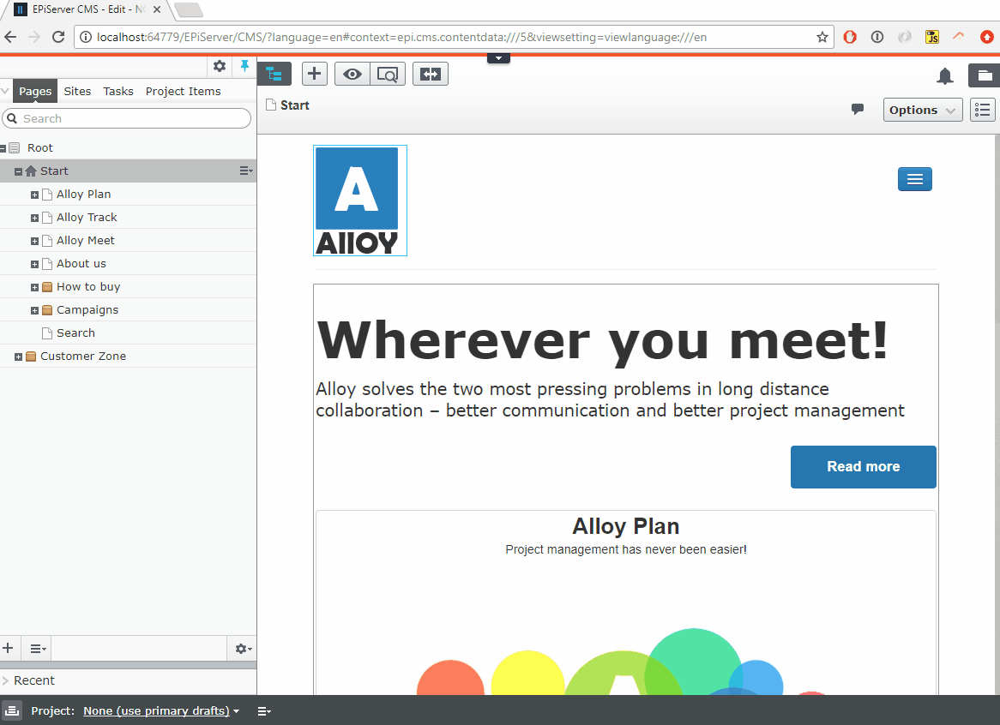
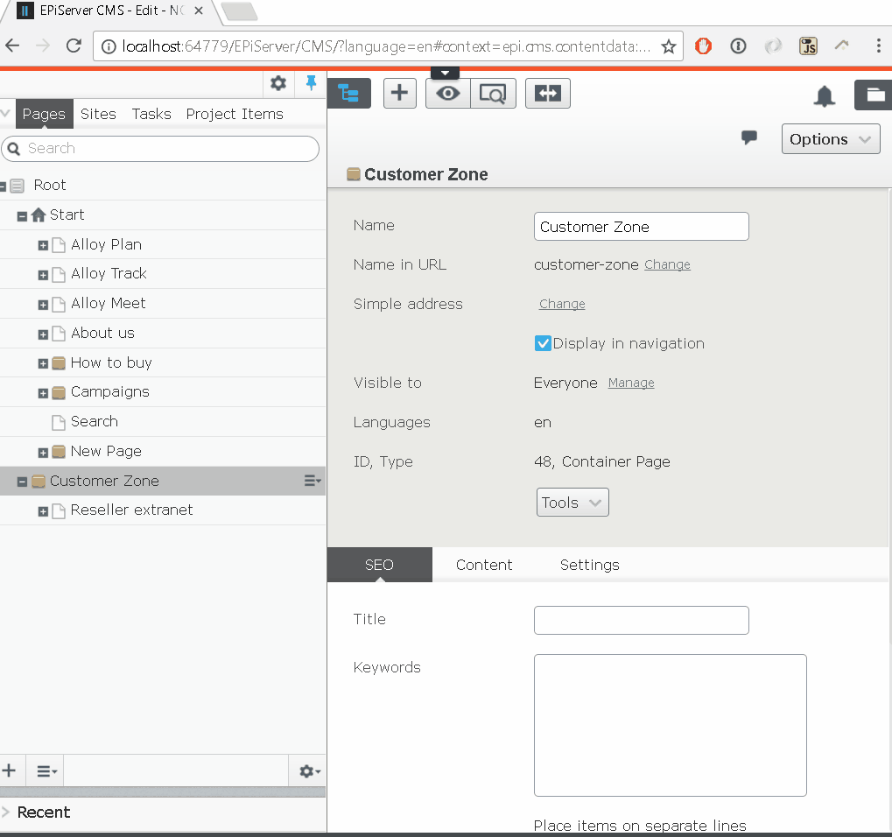

# Epinova.QuickExport

Provides a fast and easy way to export/import content directly from the page-tree in Episerver

Exports includes children, files and linked content.

Imports will regenerate ID's and skip validation in the destination.

#### Configuration

To override timeout for export download, add the following to your appsettings configuration:

`<add key="QuickExport:Timeout" value="100000" />`

The default value is 60000

To override which roles has access to the import/export function, add the following to your appsettings configuration:

`<add key="QuickExport:AllowedRoles" value="Editors,SuperAdmins" />`

The default value is "WebAdmins,Administrators"

  

#### Export demo

  

#### Import demo

 